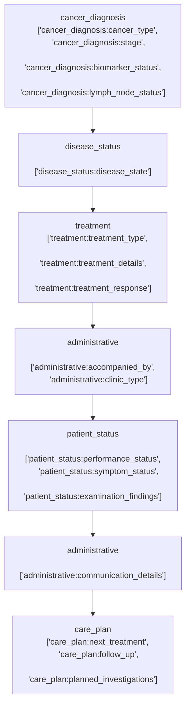

# Oncology Letter Contents

This section outlines common content found within oncology clinic letters. Content is described via thematic 'blocks', which may include: ['cancer_diagnosis', 'treatment', 'disease_status', 'patient_status', 'medical_background', 'social_background', 'clinical_trial', 'care_plan', 'administrative']. Most letters will contain only a limited set of blocks, occuring in different orders. Blocks may be repeated (for example there may be various administrative blocks scattered throughout a letter)

Each block, in turn, are structured through sequential 'subblocks'. When a block appears in a letter, it will usually only contain only a limited set of valid subblocks, in varying orders. The same block may appear multiple times in a letter, with different subblocks each time.

## Example

## Blocks and Subblocks

### Cancer Diagnosis Block ('cancer_diagnosis')

#### cancer_type
Specifies the primary cancer diagnosis including location and basic classification
* Simple example: "T2 breast cancer"
* Complex example: "T3N1M0 squamous cell carcinoma of the oropharynx, p16 positive"

#### stage
Documents the cancer staging using either TNM classification or simplified staging systems
* Simple example: "Stage 3"
* Complex example: "T4aN0 (AJCC 8th edition staging, Stage IVA)"

#### grade
Indicates the differentiation level or grade of the tumor, sometimes with associated biomarker scores
* Simple example: "Grade 2"
* Complex example: "Grade III, ER positive (8/8), poorly differentiated"

#### tumor_characteristics
Details the physical characteristics of the tumor including size, location, and appearance
* Simple example: "2cm mass in left breast"
* Complex example: "6cm clinical mass at the 12 o'clock position with satellite lesions, no skin involvement"

#### biomarker_status
Reports molecular and immunohistochemical markers relevant to diagnosis and treatment
* Simple example: "ER/PR positive"
* Complex example: "ER/PR/HER2 negative, LVI negative, Ki67 80%, PD-L1 positive (CPS 80)"

#### lymph_node_status
Details the extent and nature of lymph node involvement
* Simple example: "No nodal involvement"
* Complex example: "2/14 lymph nodes positive (8mm macro metastasis in level 1 axillary nodes)"

## metastatic_sites
Documents locations of distant disease spread if present
* Simple example: "Bone metastases"
* Complex example: "Multiple bilateral pulmonary metastases with right supraclavicular nodal involvement and extensive bone metastases including T4 vertebral body"

### Treatment Block ('treatment')

#### treatment_type
Specifies the primary modality and category of treatment being delivered
* Simple example: "adjuvant chemotherapy"
* Complex example: "neo adjuvant chemotherapy with FEC-T and concurrent Trastuzumab followed by breast conserving surgery"

#### treatment_details
Provides specific information about doses, cycles, or technical aspects of treatment
* Simple example: "cycle 2 of CAPOX"
* Complex example: "completed 6 cycles of Paclitaxel 80mg/m2 and Bevacizumab 15mg/kg with 25% dose reduction from cycle 4"

#### treatment_response
Documents the response to treatment
* Simple example: "partial response"
* Complex example: "good clinical and radiological partial response with 60% reduction in target lesions, but with new small lung nodules suggesting mixed response"

#### treatment_toxicity
Details adverse effects or complications of treatment
* Simple example: "mild fatigue"
* Complex example: "grade 2 peripheral neuropathy affecting hands and feet, requiring dose modification, and grade one tinnitus which is intermittent"

### Disease Status Block ('disease_status')

#### disease_state
Summarises the current overall cancer status and treatment response
* Simple example: "stable disease"
* Complex example: "progressive disease with mixed response - reduction in liver metastases but emergence of new bone lesions and rising tumor markers"

#### investigation_findings
Details results from recent investigations
* Simple example: "CT shows stable disease"
* Complex example: "CT scan showed stable disease in lung metastases, partial response in liver with reduction in segment 4A lesion from 3.2cm to 1.8cm, but new 5mm nodule in right lower lobe concerning for progression"

#### marker_trends
Reports relevant tumor marker trends and their interpretation
* Simple example: "PSA 4.2"
* Complex example: "CA125 has risen from 70 to 120 over 3 months with corresponding radiological progression. Previous marker nadir was 35 in June 2023"

### Patient Status Block ('patient_status')

#### performance_status
Documents functional capacity using standardized scoring systems and general wellbeing
* Simple example: "PS 1"
* Complex example: "performance status has deteriorated from WHO PS 1 to PS 2-3, now spending >50% of day in bed due to fatigue and bone pain"

#### symptom_status
Documents current cancer-related symptoms
* Simple example: "pain well controlled"
* Complex example: "progressive breathlessness on exertion with occasional chest pain, requiring increased oxygen requirement from 2L to 4L/min over past month, associated with worsening right-sided pleural effusion"

#### vital_signs
Records key physiological measurements during clinic visit
* Simple example: "normal vital signs"
* Complex example: "temperature 37.8°C, tachycardic at 116 beats/minute, blood pressure 196/106mmHg, oxygen saturations 91% on 2L/min oxygen"

#### examination_findings
Details relevant physical examination findings
* Simple example: "chest clear"
* Complex example: "chest has reduced air entry at right base with dull percussion note and tactile vocal fremitus, abdomen soft with palpable 3cm hepatomegaly but no ascites, bilateral leg edema to mid-calf"

#### weight_status
Records weight changes and their significance
* Simple example: "stable weight"
* Complex example: "weight has dropped from 82kg to 74kg over 3 months despite nutritional supplementation, now below pre-treatment baseline of 85kg, indicating ongoing cachexia"

### Medical Background Block ('medical_background')

#### comorbidities
Lists significant concurrent medical conditions that may impact cancer care
* Simple example: "hypertension"
* Complex example: "type 2 diabetes with peripheral neuropathy, CKD stage 3b (eGFR 35), severe LV dysfunction with EF 29%, and previous CVA in 2017 with residual right-sided weakness"

#### medications
Documents current medications including cancer and non-cancer treatments
* Simple example: "on tamoxifen"
* Complex example: "ramipril 5mg od, metformin 1g bd, apixaban 5mg bd, Zomorph 160mg bd recently increased from 120mg bd, breakthrough oxycodone 5mg prn, weekly alendronic acid, and monthly denosumab"

#### allergies
Records drug allergies and adverse reactions
* Simple example: "NKDA"
* Complex example: "severe penicillin allergy causing anaphylaxis requiring ICU admission in 2015, contrast allergy causing rash and bronchospasm, sensitive to codeine causing severe nausea"

### Social Background Block ('social_background')

#### living_situation
Documents domestic circumstances and support systems
* Simple example: "lives with wife"
* Complex example: "lives alone in second floor flat with no lift, previously independent but now requiring twice daily carer visits, daughter lives nearby and provides additional support with shopping and medications"

#### functional_status
Details activity level and ability to perform daily tasks
* Simple example: "fully independent"
* Complex example: "walks for about 5 miles per day despite recent chemotherapy, maintains regular swimming three times weekly, though requiring longer recovery periods between activities than previously"

#### smoking_status
Records current and historical smoking habits relevant to care
* Simple example: "never smoker"
* Complex example: "smoked for 35 years at 20 per day and stopped at diagnosis in 2022, total 35 pack-year history, continues to use nicotine replacement therapy"

### Clinical Trial Block ('clinical_trial')

#### trial_name
Identifies the specific clinical trial and protocol
* Simple example: "REACT trial"
* Complex example: "enrolled in Phase III randomised KATHERINE study comparing T-DM1 vs Trastuzumab in HER2-positive early breast cancer with residual invasive disease after neoadjuvant therapy"

#### trial_status
Documents current phase of trial participation and compliance
* Simple example: "Month 12 follow-up"
* Complex example: "completed treatment phase of PRECISION/PRIMUS 001 with good protocol compliance, experienced one dose delay due to neutropenia, now entering follow-up phase with enhanced imaging requirements as per protocol amendment 2.4"

### Care Plan Block ('care_plan')

#### next_treatment
Outlines planned immediate next steps in treatment
* Simple example: "continue current treatment"
* Complex example: "to continue with cycle 3 cisplatin and gemcitabine with primary GCSF prophylaxis, dose reduction to 80% for both agents due to previous neutropenia, delay radiotherapy until completion of systemic therapy"

#### follow_up
Specifies timing and nature of next clinical review
* Simple example: "review in 3 months"
* Complex example: "will see her weekly during radiotherapy in treatment review clinic, followed by combined clinic review with surgical team in 4 weeks, then 3-monthly follow-up with alternate CT imaging as per protocol"

#### planned_investigations
Details upcoming tests and monitoring requirements
* Simple example: "CT scan in 3 months"
* Complex example: "for EDTA clearance, baseline pure tone audiometry, dental assessment, and cardiac echo prior to starting cisplatin; arrange thrombophilia screen given family history, and repeat CT chest/abdomen/pelvis with bone windows and tumor markers in 8 weeks"

### Administrative Block ('administrative')

#### mdt_details
Records multidisciplinary team discussions and recommendations
* Simple example: "discussed at breast MDT"
* Complex example: "discussed at GSTT combined Breast MDM 14.10.23 with input from medical oncology, clinical oncology, breast surgery, and plastic surgery teams - full radiology review confirms mixed response, recommendation for change in systemic therapy"

#### clinic_type
Specifies the type and setting of clinical review
* Simple example: "follow up clinic"
* Complex example: "seen in combined surgical/oncology clinic with breast care nurse present, concurrent treatment review by chemotherapy nurse specialist, and same-day radiotherapy planning appointment"

#### accompanied_by
Documents who attended the consultation with the patient
* Simple example: "attended alone"
* Complex example: "accompanied by daughter Caroline (power of attorney) and hospital-arranged Portuguese interpreter; breast care nurse present for breaking bad news conversation"

#### communication_details
Records information sharing with other healthcare providers
* Simple example: "letter copied to GP"
* Complex example: "letter copied to GP Dr Smith, referring breast surgeon Mr Jones, community palliative care team at St Christopher's Hospice, district nursing team, and private cardiologist Dr Williams; verbal handover given to acute oncology team regarding weekend care plan"
